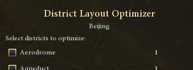
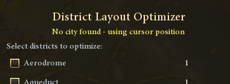
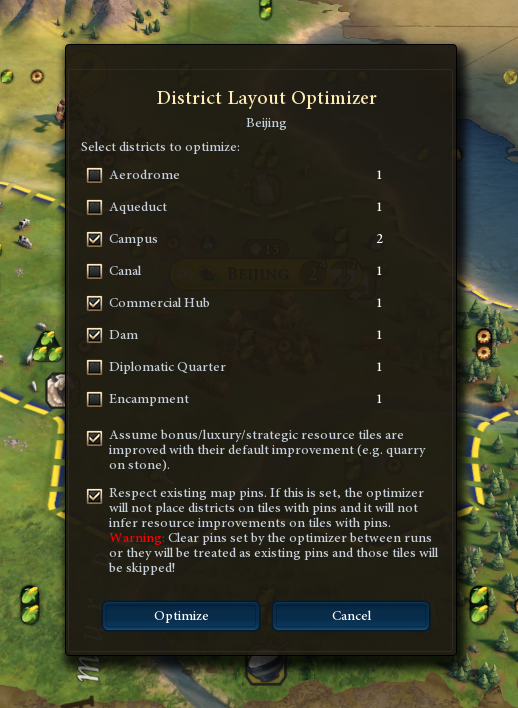
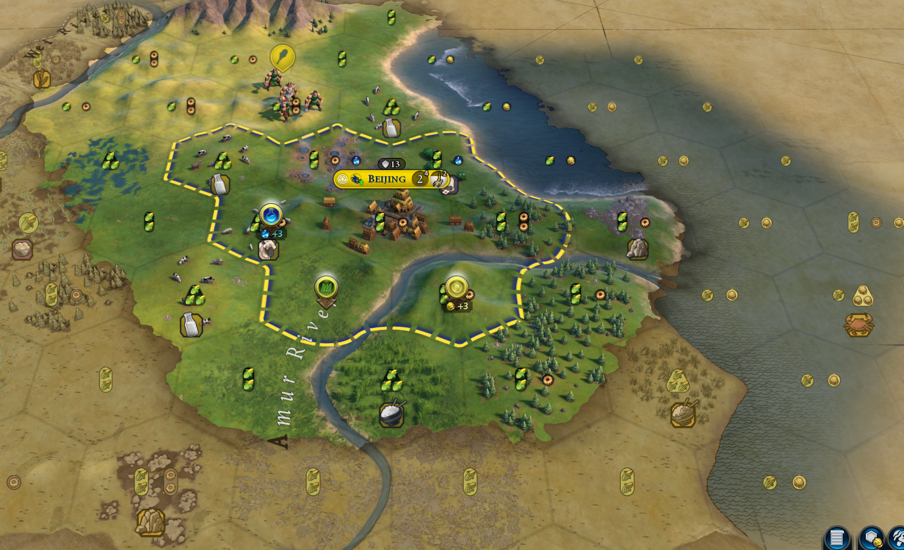

# Introduction

Are you tired of calculating adjacency bonuses for your districts?

This mod can help you plan the placement of your districts by calculating the potential yields and adjacency bonuses on your behalf.

Simply add map tacks on your map and the yields from them will show up automatically.

Enjoy planning!

# Features

1. Show map tack's potential yields from itself and adjacency bonuses.
1. Indicate if the map tack represented district or wonder can be placed at the given position.
1. Add hotkeys for adding/deleting and showing/hiding map tacks. Keys can be configured through "Game Options -> Key Bindings".
1. Allow double clicking map tack icon in the selection popup to confirm tack placement.
1. Auto delete the map tack if the represented district or wonder or improvement is added to the given plot.

# Some FAQ

Will the tack assume the features or resources are removed when calculating the bonuses?

Ans: Yes, but it depends. If the certain district or improvement is compatible with the features or resources beneath it, it will make them stay. For example, placing city center on top of resources will not remove them (if you hover on the plot, you will see the resource stays). Placing Mbanza on top of woods will not remove the woods. Similar for Vietnam's UA, where districts will be built on features.

---

There's no tool tip for improvements, is that intended?

Ans: As we develop, we found it not super helpful to show detailed bonuses for improvements, since there are not many. Also the default Game database didn't provide us the narratives for improvement's bonuses. If many of you think it'll be helpful, we will add it to our to-do list.

---

Is this mod compatible with other UI mods?

Ans: For the common mods that we are testing with, yes. Most mods won't touch the Map Tacks related logic, so we would think it should be compatible with most of mods. But if you do see any incompatibility with other mods, please let us know and we will try to accommodate.

---

Does your mod support custom districts from other mods?

Ans: If the custom district has simple adjacency bonus like terrains, features, etc, this mod should support them out of the box. If you do see anything missing from the calculation, let us know and we will try to add them.

---

What adjacency bonuses do you support?

Ans: We support all adjacency bonuses that come from the Game database, like Mountain adjacency for Campus. We also support limited set of modifier bonuses, like Sacred Path Pantheon. We are working to support more modifier bonuses.

---

I subscribed the mod, but the yields didn't show up on the tacks.

Ans: Make sure you enable the mod through "Additional Content"->"Mod". You can verify if the mod is enabled in your game through "ESC"-> "Mods in use". Also, if you are creating games by loading from your previously saved game configuration, you have to recreate the game configuration with the mods enabled. Existing game configuration won't include newly subscribed mods I believe.

# District Layout Optimizer

## Overview

Planning the perfect district layout in Civilization 6 can be a daunting puzzle. Every tile matters - a Campus next to mountains, a Holy Site surrounded by woods, an Industrial Zone flanked by mines and quarries - and manually shuffling map tacks around to compare adjacency bonuses is tedious and error-prone.

The **District Layout Optimizer** solves this for you. Select the districts you want to place, and the optimizer will automatically search through all valid tile combinations around your city to find the layout that maximizes your total adjacency bonuses. The result is placed as map tacks on the map, ready for you to review.

> **Note:** This feature is part of the Detailed Map Tacks mod. Make sure the mod is enabled via *Additional Content -> Mods* before starting your game.

## Getting Started

### Opening the Optimizer

Select a city first, then press **Shift + O** (default). The hotkey can be customized under *Game Options -> Key Bindings -> Detailed Map Tacks -> Optimize District Layout*.

If no city is selected, the optimizer uses your current cursor position as the center. If you hover your cursor over your city or over a tile that has already been claimed by the city, the optimizer will use that city for optimizations.

 

---

### The Optimizer Popup

When the popup opens, you will see:

- **City name** at the top, or a notice that no city was found and the cursor position is being used.
- A **checklist of all available districts** for your civilization, including any unique districts (e.g., Hansa for Germany, Lavra for Russia). Districts that your civ replaces with a unique variant will show the unique version instead of the base district.
- A **weight input** next to each district (more on this below).
- Two **option checkboxes** to fine-tune the optimizer's behavior.
- **Optimize** and **Cancel** buttons.

---

## How to Use

### Step 1: Select Your Districts

Check the boxes next to the districts you want the optimizer to place. You must select **at least one** district. The optimizer will try to find the best tile for each selected district around the city.

**Example:** You want to plan a Campus, Holy Site, and Industrial Zone around your new city. Check all three.

### Step 2: Set Weights (Optional)

Each district has a **weight** input field (defaults to `1`). Weights let you tell the optimizer which districts matter more to you.

The optimizer works by scoring each possible layout. It adds up all adjacency bonuses across all placed districts to get a single number. Weights act as multipliers on each district's contribution to that score.

| Scenario | Weight Setup | Effect |
|---|---|---|
| All districts equally important | Leave all weights at `1` | All adjacency bonuses count equally |
| Science is your priority | Set Campus weight to `2`, others to `1` | A Campus tile with +4 Science counts as 8 points instead of 4 |
| You don't care about Faith | Set Holy Site weight to `0.5` | Faith bonuses are halved in the scoring |

**Example:** With equal weights, two layouts might tie - Layout A gives Campus +4, Holy Site +3, Commercial Hub +2 (total 9) vs. Layout B with Campus +3, Holy Site +5, Commercial Hub +1 (also 9). Setting the Campus weight to `2` breaks the tie: Layout A scores 13 vs. Layout B's 12, so Layout A wins.

### Step 3: Configure Options

#### Assume Resources Are Improved

*Enabled by default.*

When checked, the optimizer assumes that bonus, luxury, and strategic resource tiles within range will be improved with their standard improvement (e.g., a Quarry on Stone, a Mine on Iron). This matters because improvements like Mines and Quarries provide adjacency bonuses to districts such as Industrial Zones.

- Only **visible** resources are considered (e.g., strategic resources you haven't researched the tech for yet are ignored).
- Only **standard** (non-unique) improvements are inferred - civilization-unique improvements are excluded.
- If a tile already has a built improvement, the optimizer uses the actual improvement instead of inferring one.

**When to uncheck:** If you have specific plans for certain resource tiles (e.g., you want to place a district on a resource tile rather than improve it), uncheck this to prevent the optimizer from assuming improvements on those tiles.

#### Respect Existing Map Pins

*Enabled by default.*

When checked, the optimizer will:
- **Not place districts** on tiles that already have a map pin.
- **Not infer resource improvements** on tiles that already have a map pin.

This lets you "lock in" certain tiles - for example, if you've already pinned a specific wonder or improvement location, the optimizer will work around it.

> ⚠️ **Important:** If you run the optimizer multiple times, **clear the pins from the previous run first!** The optimizer places its results as map pins, so on a second run those pins will be treated as "existing" and those tiles will be skipped.

**When to uncheck:** If you want the optimizer to have full freedom and ignore any pins you've placed, uncheck this option.

### Step 4: Click Optimize

Press the **Optimize** button. The optimizer will search for the best layout and:

- **On success:** Place map tacks at the optimal positions. The popup closes automatically.
- **No valid placement:** If no legal placement exists for the selected districts, a message will tell you so.

---

## How It Works under the hood - Design Decisions

Understanding how the optimizer works under the hood can help you get the most out of it.

### Search Algorithm: Constrained Backtracking

The optimizer uses a **backtracking search** algorithm. It systematically tries placing each selected district on each valid tile, then recurses to place the next district, and so on. After all districts are placed, it evaluates the total adjacency score. If this score beats the current best, it becomes the new best. Then it "backtracks" - undoes the last placement and tries the next candidate tile.

This is an **exhaustive search** (up to an iteration limit), meaning it will find the true optimum as long as the search space is small enough.

### Most-Constrained-First Ordering

Before searching, the optimizer sorts the districts by **how many valid candidate tiles** each one has (fewest first). This is a classic constraint-satisfaction heuristic - by placing the most restricted district first, the algorithm prunes dead-end branches early and searches more efficiently.

For example, if your Aqueduct can only go on 2 tiles but your Campus has 8 options, the Aqueduct is placed first.

### Virtual Pin System

During the search, the optimizer doesn't create actual map pins. Instead, it uses a **virtual pin lookup table** - a fast in-memory data structure that tracks where hypothetical districts are placed. When evaluating adjacency bonuses, it checks this virtual table first and only falls back to real map pins for tiles not part of the current search.

This means the search is non-destructive: your existing pins and map state are untouched until the optimizer finishes its search.

### Adjacency Evaluation

Each candidate layout is scored by calculating **adjacency bonuses** for every placed district, using the same yield calculation engine that powers the regular Detailed Map Tacks display. This includes:

- Standard adjacency bonuses from the game database (mountains for Campus, woods for Holy Site, etc.)
- Modifier-based bonuses (e.g., Sacred Path pantheon giving Holy Sites adjacency from rainforest)
- Adjacency from other districts in the layout (e.g., placing a Commercial Hub next to a Harbor)
- Adjacency from existing built districts, improvements and existing map pins

> **Note**: Unrevealed plots are rarely taken into account since their adjacency features are all nil, producing a score of 0. For the best experience it is recommended to have a radius of 4 tiles from your city center revealed, especially early in the game (e.g. when planning the first city).

### Scoring & Weights

All yield amounts are summed into a single score. Each district's yields are multiplied by its weight before being added. The layout with the highest total score wins.

### Existing Districts & Pins

The optimizer is aware of:
- **Already-built districts** in the city: these are treated as fixed and provide adjacency bonuses to the districts being optimized, but their tiles are not available for new placements.
- **Existing map pins** (when "Respect Existing Pins" is on): these tiles are skipped for placement and resource inference, but are taken into account for adjacency bonuses (e.g. when you place a Quarry pin on a Stone resource).

### Placement Radius

- Districts can be placed within **3 tiles** of the city center (the standard Civ 6 workable radius).
- Adjacency bonuses are evaluated including tiles up to **4 tiles** from the city center (one ring beyond placement range), since a district on the edge can still get adjacency from tiles outside the city's workable area.

---

## Limitations

Please keep these limitations in mind:

### Iteration Cap

The optimizer has a hard cap of **100,000 search iterations**. If the search space is very large (many districts selected, many candidate tiles each), the optimizer will stop after 100,000 iterations and return the **best result found so far**, which may not be the true global optimum.

**Tip:** To get better results when optimizing many districts, consider running the optimizer in smaller batches (e.g., optimize 2–3 districts at a time, lock them in with pins, then optimize the next batch).

### Adjacency Only

The optimizer **only considers adjacency bonuses**. It does not account for:
- District base yields or building yields.
- Tile yields lost by placing a district on a tile.
- Strategic considerations like defending districts from loyalty pressure or military threats.
- Appeal or tourism implications.
- Aqueduct/Dam housing bonuses (though it will respect placement validity - e.g., Aqueducts must be next to a river/mountain/lake).

### No Cross-City Optimization

The optimizer works on **one city at a time**. It does not consider how district placement in one city might affect adjacency in a neighboring city.

That being said, pins and existing districts/improvements in a neighboring city are taken into account. For example, you have two neighboring cities (A and B). You're optimizing City A, while City B already has a dam built. If the tile next to the dam belongs to City A, the optimizer will consider placing an industrial zone next to the dam.

### Fixed-radius Search

The optimizer searches in a fixed 3-hex radius around the selected city's center. If two cities are close enough that their workable radius (3 tiles) overlaps, the optimizer does not check which tile belongs to which city.

You can give the optimizer a hint by placing any pin (I personally like the 🚫 pin) on tiles which don't belong to the city you're trying to optimize. As long as the "Respect existing pins" option is enabled, those tiles will then be disregarded for district placement.

### Unique Improvements Not Inferred

When "Assume Resources Are Improved" is enabled, only **standard improvements** are inferred (Mine, Quarry, Plantation, etc.). Civilization-unique improvements (e.g., Sphinx, Ziggurat) are not automatically assumed.

Furthermore the default improvements are only inferred on resource tiles. Tiles without resources are too numerous and would make the search space explode, hence no automatic improvement is inferred.

You can put pins with specific improvements on any tile, and the optimizer will take it into account (if "Respect existing pins" is enabled).

### Pin Cleanup Between Runs

If "Respect Existing Pins" is enabled and you run the optimizer multiple times for the same city, you **must manually clear** the pins from the previous run. Otherwise, the optimizer treats its own previous output as fixed constraints and skips those tiles.

### Performance

The backtracking search runs synchronously. For large search spaces, there may be a brief pause (typically a few seconds) while the optimizer works. The UI shows an "Optimizing layout..." message during this time.

On my PC the optimizer managed around 3,000 iterations per second, so the 100,00 maximum iterations can take some 30 seconds.

### Placement Validity

The optimizer checks whether each district **can legally be placed** on each candidate tile (terrain requirements, feature restrictions, etc.) using the same validation the game uses. However, it does not account for:
- District population requirements (e.g., needing 7 population for a second district).
- Technology/civic prerequisites for unlocking a district.
- Per-game district limits.

The optimizer assumes you *will* be able to build the selected districts - it's a planning tool for future placement.

---

## Quick Reference

| Feature | Details |
|---|---|
| **Default Hotkey** | Shift + O |
| **Hotkey Config** | Game Options -> Key Bindings -> Detailed Map Tacks |
| **Placement Radius** | 3 tiles from city center |
| **Max Search Iterations** | 100,000 |
| **Scoring Method** | Weighted sum of all adjacency yields |
| **Default Weight** | 1 (per district) |
| **Output** | Map tacks placed at optimal positions |

---

## Tips & Tricks

1. **Start with your most important districts.** Optimize 2–3 key districts first, lock them in, then run again for the next batch.
1. **Use weights strategically.** If you're going for a Science victory, bump up the Campus weight. Going for a Religious victory? Increase the Holy Site weight.
1. **Clear pins between runs.** Always remove previous optimizer pins before re-running, or uncheck "Respect Existing Pins" if you want a fresh search.
1. **Use with existing map tacks.** Pin down wonders or improvements you've already decided on, enable "Respect Existing Pins", and the optimizer will plan around your choices.
